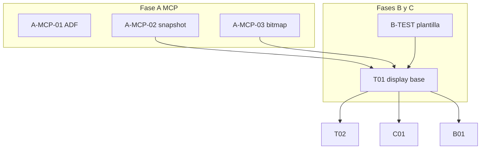

# Roadmap de implementación Amiga (MCP, tests, engine)

**Propósito:** una sola vista de **qué está hecho**, **qué está a medias** y **qué falta**, alineada con [amiga-test-battery-spec.md](amiga-test-battery-spec.md) (especificación y §2 visión IA) y [mcp-live-coding-workflow.md](mcp-live-coding-workflow.md).

**Sistema de agentes y supervisión:** roles (Orquestador, MCP, batería, engine, QA), cola de trabajo, DoD y checklists en [agent-system-roadmap.md](agent-system-roadmap.md).

**Cómo mantenerlo:** al cerrar un ítem, cambia el estado en las tablas de este archivo y, si aplica, el texto de [amiga-test-battery-spec.md](amiga-test-battery-spec.md) §2. Los IDs de prueba (T01, B03…) pasan de **PENDIENTE** a **HECHO** cuando existen código + `evidence/` mínimo + `README.md` en `tests/amiga-battery/<id>_*` o efecto equivalente en `app/effects/` enlazado desde el menú o script.

---

*Actualización posterior: A-MCP-02 queda en HECHO tras validar en vivo `winuae_machine_snapshot` con una sesión WinUAE visible y guardar evidencia en `out/a-mcp-02-live-machine-snapshot.json`.*

## Leyenda de estados

| Estado | Significado |
|--------|-------------|
| **HECHO** | Implementado y usable en el flujo descrito. |
| **PARCIAL** | Existe pieza pero faltan criterios de aceptación o matriz de casos. |
| **PENDIENTE** | No implementado. |
| **N/A** | Fuera de alcance o cubierto por otro ítem. |

---

## 1. Resumen: qué falta (instantánea)

| Ámbito | HECHO | PARCIAL | PENDIENTE |
|--------|-------|---------|-----------|
| **Herramientas MCP / visión §2** | memoria R/W, custom regs, copper disasm, CPU regs, breakpoints, step, screenshot, load/run/exec_chunk, perfiles, ADF caliente con matriz documentada `connect`/`connect_existing`, `machine_snapshot` validado en vivo | `bitmap_decode` (implementado; pendiente validación viva), búsqueda de patrones en RAM (implementada; pendiente validación viva), carga con reloc AmigaHunk (implementada; pendiente validación viva), breakpoints condicionales asistidos por software (implementados; pendiente validación viva y sin soporte nativo del stub) | BP condicional nativo en stub |
| **Infra repo (Cursor-Amiga-C)** | configs `.uae` A500/A1200/CD32, `TARGET_MACHINE`, workflow doc, technique_lab menú, demo scroll+bobs, plantilla `tests/amiga-battery/_template/`, índice enlazado, runner común `scripts/run-battery-case.mjs`, análisis visual LM Studio en `scripts/lmstudio-vision.mjs`, config limpia `.vscode/mcp-amiga-battery.uae`, postmortem automático en el pipeline, smoke test mínimo `M00_smoke_dos_adf`, ruta `metal/direct` reproducible con `M10_smoke_metal` y stub metal reutilizable en `tests/amiga-battery/common/metal/` + `_template-metal/` | Harness C compartido en `tests/amiga-battery/common/` pendiente de uso por casos reales; T01 sigue en parcial por fallo de runtime/requester al ejecutar aunque el aislamiento y la autopsia ya están mejor resueltos | Launcher por prueba, golden PNG y casos reales T/C/B/... |
| **Batería gráfica §8** | T00, T01, T02, T06, T07, C01, B01–B06, S01, S04, S05 (casos con carpeta + evidencia) | M03 y S02 siguen en PARCIAL por alcance o estabilidad de cierre visual | T03–T05, T08, C02–C05, B07, S03, A01–A03, M01–M03, AG01–AG03 |
| **Engine** (detalle) | Ver [engine-roadmap.md](engine-roadmap.md) | APIs copper/blitter avanzadas | Catálogo demoscene → `engine_*` |

---

## 2. Fase A — MCP y fork WinUAE (`mcp-winuae-emu` / WinUAE-DBG)

Criterios de aceptación breves en la columna **Criterio “cerrado”**.

| ID | Entrega | Estado | Criterio “cerrado” |
|----|---------|--------|-------------------|
| **A-MCP-01** | ADF / disco en caliente unificado | HECHO | Matriz documentada con `mcp-winuae-emu/scripts/a-mcp-01-matrix.mjs` y evidencia `mcp-winuae-emu/test-output/a-mcp-01-matrix/report.{json,md}`. Validación viva: `winuae_connect` preconfigura DF0-DF3 en arranque/reinicio y `winuae_connect_existing` + `dfN insert/eject` funciona en caliente en DF0-DF3 sobre una sesión externa visible. Queda documentada como limitación de build que una sesión lanzada por MCP no siempre sobrevive a `disconnect(false)` para reutilizarse entre turnos. |
| **A-MCP-02** | `winuae_machine_snapshot` | HECHO | Validado en vivo con `mcp-winuae-emu/scripts/a-mcp-02-live.mjs` y evidencia en `Cursor-Amiga-C/out/a-mcp-02-live-machine-snapshot.json` + `Cursor-Amiga-C/out/a-mcp-02-live-validation-summary.json`: devuelve CPU + custom + ventanas opcionales chip/fast RAM, trunca chip RAM a 16 KiB como se documenta y conserva errores por región (`fast`) sin romper el snapshot. |
| **A-MCP-03** | `winuae_bitmap_decode` (planar → PNG/RGB) | PARCIAL | Implementado en `mcp-winuae-emu` con salida PNG o RGBA, soporte 4/5/6+ planos, interleaved/no interleaved, ancho/alto y paleta desde args o custom regs; falta validación en vivo con WinUAE para marcar HECHO. |
| **A-MCP-04** | Búsqueda de patrones en RAM | PARCIAL | Implementado en `mcp-winuae-emu` con búsqueda exacta por `pattern_hex`, rango configurable y scoring opcional por `stride_bytes` + `repeat_count`; devuelve candidatos con dirección y score, pero falta validación en vivo con WinUAE para marcar HECHO. |
| **A-MCP-05** | Carga con reloc AmigaHunk | PARCIAL | `winuae_load` detecta ejecutables AmigaHunk típicos, asigna hunks contiguos y aplica `RELOC32` antes de escribir en memoria; falta validación en vivo con WinUAE para marcar HECHO. |
| **A-MCP-06** | Breakpoints condicionales | PARCIAL | Implementado en `mcp-winuae-emu` como `winuae_breakpoint_conditional_wait`: usa breakpoints normales y evalúa condiciones de registros, custom regs o memoria desde el servidor MCP. El stub GDB de WinUAE sigue sin exponer condiciones nativas tipo expresión, y falta validación viva para marcar HECHO. |
| **A-MCP-07** | Documentación README MCP | HECHO | `mcp-winuae-emu/README.md` lista las herramientas actuales, documenta sesión reutilizable/auto-attach y `winuae_screenshot` con fallback de ventana host, y enlaza con este roadmap y el spec §2. |

**Dependencias externas:** comandos monitor en WinUAE-DBG; si **A-MCP-02** requiere nuevo `qRcmd`, anotarlo en el HANDOVER del fork.

---

## 3. Fase B — Infraestructura de tests en Cursor-Amiga-C

| ID | Entrega | Estado | Criterio “cerrado” |
|----|---------|--------|-------------------|
| **B-TEST-01** | Plantilla `tests/amiga-battery/_template/` | HECHO | Existe `_template/` con `README.md`, `case.json`, `src/main.c`, `docs/technique.md`, `evidence/README.md` y `.gitkeep`, fijando la convención para todos los casos. |
| **B-TEST-02** | `tests/amiga-battery/README.md` índice con estados | HECHO | `tests/amiga-battery/README.md` enlaza spec, roadmap, plantilla, harness común e IDs de Fase B/C con estado base y convención de carpetas. |
| **B-TEST-03** | Script `scripts/run-battery-case.sh` (o Node) | HECHO | Existe `scripts/run-battery-case.mjs`: valida la estructura del caso, ejecuta build + ADF y deja preparado el flujo común de evidencia (snapshot/screenshot) con `case.json` como manifiesto. Desde abril de 2026 exige además artefactos de análisis visual LM Studio cuando el caso produce `live-screen.png` o `decoded-playfield.png`, valida política de cierre de sesión (`disconnectPolicy.stopEmulator`) para encadenar tests sin contaminar estado, y rechaza evidencia en `host_window` para forzar captura interna del emulador en la batería. En la tanda actual se añade política **fast-fail** (preflight MCP/WinUAE, timeout por etapa, límite de reconexiones, warmup mínimo y corte forzado de procesos colgados) para que tests lentos fallen en segundos/minutos en vez de bloquear tandas largas. |
| **B-TEST-04** | Integración menú o launcher para efectos battery | PENDIENTE | Entrar/salir de cada efecto sin reiniciar UAE (o documentar reset). |
| **B-TEST-05** | Ruta `metal/direct` reusable | HECHO | Existe infraestructura integrada al build en `tests/amiga-battery/common/metal/` y `tests/amiga-battery/_template-metal/`, y un caso reproducible `tests/amiga-battery/M10_smoke_metal/` que compila, carga por `winuae_load`, entra por `battery_metal_entry`, genera evidencia visible y demuestra parcheo simbólico en RAM (`g_m10_palette_mode`), comandos consumibles (`SET_MODE`, `EXIT`) y handlers de excepción (`TRIGGER_ILLEGAL`) sobre el contrato `g_battery_metal_control`. |
| **B-TEST-06** | Dev harness disk / launcher residente | PARCIAL | Existe un primer caso DOS-friendly en `tests/amiga-battery/M03_dev_harness_disk/` y un bloque de control común `g_battery_dev_harness` en `tests/amiga-battery/common/`. También existe ya una ruta MCP de attach no intrusivo (`force_break=false`, `initialize_stopped=false`), un modo `--fresh-launch` para aislar el boot del ADF, una generación ADF estable por `scripts/create-adf.bat`, y una utilidad dedicada `scripts/send-dev-harness-command.mjs` para hablar con el bloque del harness cuando el símbolo sea resoluble. La validación viva ya confirma `floppy0=<adf>` en el arranque limpio, pero el launcher sigue cayendo en `Software error - task held`; M00 reproduce el mismo requester, así que el foco inmediato se desplaza hacia el `startup-sequence`/loader DOS o la configuración de arranque compartida. La revalidación más reciente volvió a hacerse sobre la configuración base A500/Kickstart 1.3 (`.vscode/mcp-amiga-battery.uae` con `KICK13.rom`) y el requester persiste, así que el bloqueo sigue siendo real en la plataforma objetivo. En la tanda actual el mailbox del harness ya da un paso más: `payload_path`, `payload_stack_size`, `loader_result`, `loader_ioerr` y `payload_seglist` dejan preparada la vía `LoadSeg`/`RunCommand` como ruta principal para payloads DOS, además del puente DOS -> metal por `metal_control_address`. Ya hay prueba viva de **carga en caliente** con `LoadSeg()` usando `dh1:payload.exe`: el harness llega a `stage=7`, deja `payload_seglist` no nulo y mantiene el pulso. La fase `RunCommand()` también se alcanza (`stage=8`), pero la ejecución DOS hot-run sigue en parcial porque el payload todavía no retorna limpio sobre el launcher y aparecen requesters de `task held`. Ver `doc/amiga-dev-harness-loader.md` y `doc/amiga-kernel-loader-notes.md`. |

---

## 4. Fase C — Batería gráfica / hardware (IDs del spec §8)

Cada fila debe reflejar implementación verificada real (**PENDIENTE / PARCIAL / HECHO**) y enlazar la ruta de código/evidencia cuando aplique.

| ID | Nombre corto | Estado | Notas / dependencias |
|----|--------------|--------|----------------------|
| T00 | Lores 4 colores (2 bitplanes) | HECHO | Caso cerrado en `tests/amiga-battery/T00_lores_4c_chart/` con carta de ajuste geométrica + HUD numérico CPU reutilizable. Validación viva ADF: `stage_id=0x0405`, `assert_failures=0`, `bitplane_count=2` y análisis visual LM Studio conforme. |
| T01 | Lores 16 colores | HECHO | Caso cerrado en `tests/amiga-battery/T01_lores_16c/` con barras verticales de 16 colores y evidencia viva por ruta ADF/OS-loader. Validación reciente: `stage_id=0x1005`, `assert_failures=0`, `BPLCON0=$4200`, `bitplane_count=4`, sin requester en pantalla y veredicto LM Studio conforme. |
| T02 | Lores 32 colores | HECHO | Caso cerrado en `tests/amiga-battery/T02_lores_32c/` por ruta ADF/AmigaDOS con 5 bitplanes, patrón CPU (lattice + guías geométricas) y HUD numérico. Validación viva: `stage_id=0x2005`, `assert_failures=0`, `BPLCON0=$5200`, `bitplane_count=5` y LM Studio confirma objetivo visual. Nota residual: `winuae_bitmap_decode` sigue siendo intermitente en reconnect, sin bloquear criterio del caso. |
| T03 | EHB | PENDIENTE | ECS/AGA según máquina. |
| T04 | HAM6 | PENDIENTE | |
| T05 | Hires | PENDIENTE | Opcional. |
| T06 | Dual PF 3+3 estático | HECHO | Caso cerrado en `tests/amiga-battery/T06_dual_pf_3p3_offset/` con fondo 8 colores, foreground transparente y desplazamiento diferenciado por playfield (`BPLCON1`). Validación viva: `stage_id=0x0605`, `assert_failures=0`, `BPLCON0=$6200`, `bitplane_count=6`, evidencia LM Studio positiva. |
| T07 | Dual PF scroll H/V | HECHO | Caso dedicado cerrado en `tests/amiga-battery/T07_dual_pf_scroll_independent/`: viewport 320x240, buffers internos por playfield de 640x480 (4x área), scroll independiente a 1 px/frame (PF1 horizontal y PF2 vertical) y evidencias estáticas + secuencia APNG con validación LM Studio. Validación viva: `stage_id=0x0705`, `assert_failures=0`, `bitplane_count=6`. |
| T08 | Modulo tricks | PENDIENTE | technique_lab como referencia mínima, no sustituye escena completa. |
| ST01 | Scroll X externo destilado | PARCIAL | Caso implementado en `tests/amiga-battery/ST01_scroll_x_external/` con scroll horizontal fine+coarse (`BPLCON1` + `BPL1PT`) y build validado (`out/battery_ST01.exe`). Esta iteracion conecta ST01 al adapter de ingesta `engine_external_scroll` (formulas ACE `scrollbuffer` + scheduler de carga `xyunlimited2`), corrige popping en primera columna y salto periodico de 16 px, y mantiene invariantes runtime (`assert_failures=0`, `stage_id=0xE105`). Queda pendiente cerrar metrica visual temporal por delta de pixel en secuencia para declararlo HECHO. |
| ST02 | Scroll Y externo destilado | PARCIAL | Caso ya creado en `tests/amiga-battery/ST02_scroll_y_external/` con scroll vertical visible, buffer circular `320x288`, recarga incremental de la franja oculta y split de copper para envolver el buffer. Falta cerrar la extraccion reusable al engine y validar la secuencia temporal final para promoverlo. |
| ST03 | Scroll XY retained (camara) | PENDIENTE | Tercera fase: composición XY sobre capa retained (camara/escena) consumiendo primitivas low-level previas sin duplicar setup hardware. |
| ST04 | Scroll XY + tilebuffer retained | PARCIAL | Caso activo en `tests/amiga-battery/ST04_tilebuffer_retained_external/` sobre `engine_scene_tilebuffer`, pero actualmente sin validacion visual aceptable como referencia retained reusable. La secuencia ya exige cambio visual real y continuidad minima; el caso queda bloqueado porque solo alcanza `frames_with_pixel_change_ratio=0.126984` y `avg_changed_ratio=0.06339`, insuficientes para demostrar scroll XY retained coherente. |
| C01 | Copper degradado V | HECHO | Caso dedicado en `tests/amiga-battery/C01_copper_vertical_gradient/` validado por `scripts/validate-metal-vector.mjs` sobre `out/battery_C01.exe`, con evidencia visual verificada por LM Studio en `vision-metal-set_mode-after.*` y `vision-metal-exit-after.*`. Se mantiene como nota técnica que el contrato de comandos metal puede ser inestable en esta técnica y actualmente se permite cierre visual-first (`--require-command-contract false`) con fallback trazable de sesión. |
| C02 | Copper multibanda | PENDIENTE | |
| C03 | Copper bars | PENDIENTE | |
| C04 | Copper + BFD blitter | PENDIENTE | |
| C05 | Copper chunky | PENDIENTE | |
| B01 | Blit fill rect | HECHO | Caso validado por ruta ADF/AmigaDOS en `tests/amiga-battery/B01_blit_fill_rect/` con evidencia interna, runtime markers y descripción visual LM Studio coherente con rectángulo blitteado. |
| B02 | Blit copy | HECHO | Caso nuevo en `tests/amiga-battery/B02_blit_copy/` validado por ruta ADF/AmigaDOS. Evidencia viva: `runtimeState.stage_id=0xB205`, `assert_failures=0`, DMA/copper correctos y captura interna con dos bloques patrón donde el destino replica la fuente vía blit A->D. |
| B03 | Blit línea | HECHO | Caso nuevo en `tests/amiga-battery/B03_blit_line/` validado por ruta ADF/AmigaDOS. Evidencia viva: `runtimeState.stage_id=0xB305`, `assert_failures=0`, `bitplane_count=2` y captura interna con marco + diagonales multi-octante descritas por LM Studio. |
| B04 | Polígono relleno | HECHO | Caso nuevo en `tests/amiga-battery/B04_polygon_fill/` validado por ruta ADF/AmigaDOS. Evidencia viva: `runtimeState.stage_id=0xB405`, `assert_failures=0`, `bitplane_count=1` y triángulo relleno reconocido por LM Studio. |
| B05 | Minterm / BOB | HECHO | Caso nuevo en `tests/amiga-battery/B05_minterm_bob/` validado por ruta ADF/AmigaDOS. Evidencia viva: `runtimeState.stage_id=0xB505`, `assert_failures=0`, `bitplane_count=1` y composición BOB enmascarada sobre checkerboard confirmada por análisis visual LM Studio. |
| B06 | Blit shift | HECHO | Caso nuevo en `tests/amiga-battery/B06_blit_shift/` validado por ruta ADF/AmigaDOS. Evidencia viva: `runtimeState.stage_id=0xB605`, `assert_failures=0`, `bitplane_count=1` y desplazamiento horizontal por blitter A->D confirmado en captura interna y análisis LM Studio. |
| B07 | CPU+blit bandas | PENDIENTE | A1200 preferente. |
| S01 | Sprites HW | HECHO | Caso `tests/amiga-battery/S01_hardware_sprite/` validado en vivo por ruta ADF con runtime/evidence log (`stage_id=0x5012`, `assert_failures=0`) y captura interna/host mostrando barras verticales de sprite sobre fondo checker. Cierre técnico: recarga de `SPRxPT` y `POS/CTL` cada VBL para compensar el avance natural del puntero DMA de sprites en OCS. Evidencia principal en `tests/amiga-battery/S01_hardware_sprite/evidence/adf-live-validation-summary.json`. |
| S02 | Sprites attach | PARCIAL | Caso ya existente en `tests/amiga-battery/S02_attached_sprite_pairs/` con código, secuencia y evidencia viva por ADF (`stage_id=0x5212`, `assert_failures=0`). Sigue en `PARCIAL` porque el cierre visual aún es conservador: la evidencia actual muestra objetos adjuntos y telemetría sana, pero el veredicto LM Studio sigue señalando desajustes en riqueza multicolor, transparencia o fondo de referencia respecto al objetivo declarado. |
| S03 | Prioridad sprite/PF | PENDIENTE | |
| S04 | BOBs | HECHO | Caso cerrado en `tests/amiga-battery/S04_dualpf_blitter_bobs/` con foreground dual PF y BOBs por blitter (`cookie-cut`). Ahora usa rutina reusable `engine_sprite_blit_cookie_cut_clipped` (blitter directo + fallback CPU con clipping en bordes). Validación viva: `stage_id=0x5405`, `assert_failures=0`, `bitplane_count=6`, y LM Studio confirma objetos BOB + HUD sobre fondo reconocible. |
| S05 | Soft sprites CPU | HECHO | Caso cerrado en `tests/amiga-battery/S05_dualpf_cpu_sprites/` con foreground dual PF para sprites software CPU. Ahora cubre clipping en bordes y ciclo save/restore de fondo con APIs reusables (`engine_sprite_cpu_draw_masked_interleaved`, `engine_sprite_cpu_save_rect_interleaved`, `engine_sprite_cpu_restore_rect_interleaved`). Validación viva: `stage_id=0x5505`, `assert_failures=0`, `bitplane_count=6`, con confirmación visual LM Studio de posiciones y HUD. |
| A01 | Paula 1 canal | PENDIENTE | |
| A02 | Paula 4 canales | PENDIENTE | |
| A03 | Mix software | PENDIENTE | |
| M01 | Colisiones | PENDIENTE | |
| M02 | VBL / IRQ | PENDIENTE | |
| M03 | WB ↔ metal | PARCIAL | Primer paso abierto como `tests/amiga-battery/M03_dev_harness_disk/`: launcher DOS-friendly con bloque público de control en RAM. El arranque limpio con `--fresh-launch` ya elimina la contaminación de `connect_existing + reset`, y la generación/boot del ADF ya queda confirmada con `floppy0=<adf>` en el log. Aun así, el caso sigue en requester `Software error - task held` y `qOffsets` no ofrece aún una base simbólica fiable. La ruta metal objetivo ya está concretada en `M10_smoke_metal` y su contrato `g_battery_metal_control`, y existe ya `scripts/send-dev-harness-command.mjs` para el puente cuando el launcher entre de verdad. Falta todavía la transición completa WB ↔ harness ↔ payload metal ↔ vuelta al sistema. |
| M04 | Payload DOS auxiliar | PARCIAL | Payload mínimo en `tests/amiga-battery/M04_payload_dos_smoke/` para validar la ruta `LoadSeg`/ejecución DOS desde M03. En el flujo `devfs` la ruta correcta ya queda identificada como `dh1:payload.exe`; `PROGDIR:payload.exe` provocaba requesters de volumen inexistente. No es un caso final de batería, sino un artefacto de aislamiento para B-TEST-06. |
| M05 | Payload CLI hotrun | PARCIAL | Payload DOS ultramínimo en `tests/amiga-battery/M05_payload_cli_hotrun/` para aislar `RunCommand()` sin `battery_case_run`, gráficos ni engine. La validación standalone por `devfs` no da requester, pero la evidencia visual todavía no es suficiente para declararlo como prueba limpia de hot-run. |
| M06 | Dev harness headless | PARCIAL | Variante sin UI de `M03` en `tests/amiga-battery/M06_dev_harness_headless/` para aislar el launcher DOS de Intuition. La primera validación viva sigue mostrando `Software error - task held`, así que el problema residual no se explica solo por la ventana/pantalla del harness. |
| M00 | Smoke DOS ADF | PARCIAL | Caso mínimo en `tests/amiga-battery/M00_smoke_dos_adf/` para validar `exe2adf + ADF + arranque de ejecutable DOS` sin mezclar harness complejo, Intuition ni takeover. Tras estabilizar la generación ADF en Windows y el montaje previo de DF0, el caso reproduce el mismo requester `Software error - task held` que M03, así que sirve como control base fuerte antes de seguir diagnosticando M03/T01. |
| M10 | Smoke metal directo | HECHO | Caso reproducible en `tests/amiga-battery/M10_smoke_metal/` para validar el camino `winuae_load` + `battery_metal_entry` sin depender de AmigaDOS. La evidencia directa incluye captura visible, postmortem, parcheo simbólico en RAM, comandos consumibles (`SET_MODE`, `EXIT`) y una autopsia de `TRIGGER_ILLEGAL` que deja tanto señal visual roja como estado legible en `g_battery_metal_control` (`stage_id=0xFFFF`, `detail=4`, `status_flags=0x00040000`, `last_error=4`). |
| V01 | Vector metal visual simple | HECHO | Primer vector visual base en `tests/amiga-battery/V01_raster_bars_metal/`. La validación dedicada `scripts/validate-metal-vector.mjs` ya pasa en vivo con `SET_MODE(1)` y `EXIT`, dejando `status_flags=0x00020001` y `0x00010000` en `tests/amiga-battery/V01_raster_bars_metal/evidence/vector-validation-summary.json`. El tooling de comandos metal ya exige progreso real (`heartbeat`/`status_flags`) antes de aceptar el acuse, evitando falsos positivos de readback temprano. |
| V02 | Vector metal pulso de paleta | HECHO | Caso validado en `tests/amiga-battery/V02_palette_pulse_metal/` con [scripts/validate-metal-vector.mjs](scripts/validate-metal-vector.mjs): `SET_MODE(1)` deja `status_flags=0x00020001` y `EXIT` deja `status_flags=0x00010000` en `tests/amiga-battery/V02_palette_pulse_metal/evidence/vector-validation-summary.json`. Durante la depuración se detecto que una variante inicial más compleja era sensible al layout del artefacto `.elf -> .exe` al cargarlo en caliente; la version actual queda reducida y alineada con `M10` como baseline estable antes de reintroducir complejidad. |
| V03 | Vector metal por bandas de scanline | HECHO | Caso validado en `tests/amiga-battery/V03_scanline_bands_metal/` con `scripts/validate-metal-vector.mjs`: `SET_MODE(1)` y `EXIT` pasan en vivo con `status_flags=0x00020001` y `0x00010000` (ver `tests/amiga-battery/V03_scanline_bands_metal/evidence/vector-validation-summary.json`). La validación ahora separa artefactos por comando y aplica fallback automático de `EXIT` a `fresh-launch` cuando falla `connect_existing`, dejando evidencia trazable sin falsos positivos por readback degradado. |
| AG01 | AGA planos/FMODE | PENDIENTE | Perfil `amiga1200.uae` / `cd32.uae`. |
| AG02 | AGA paleta 24-bit | PENDIENTE | |
| AG03 | AGA blitter ancho | PENDIENTE | |

**Orden sugerido** (igual que spec §9): T01→T02→C01→B01→B02→B03→B04→T06→T07→T03→T04→S01→S04→…

**Relación con código actual:**

| Componente actual | Cubre (parcialmente) |
|-------------------|----------------------|
| `app/effects/demo_scroll_bobs/` | B02/B04/S04, scroll, audio P61 — **no** sustituye IDs hasta tener carpeta battery + criterios. |
| `app/effects/technique_lab/` | Lectura módulos / overlay — acercamiento a T08, no cerrado como test. |
| `app/main.c` menú / Intuition | M03 parcial (flujo WB no documentado como test). |

---

## 5. Fase D — Engine (`engine/`) y catálogo demoscene

No duplicar todo [engine-roadmap.md](engine-roadmap.md); aquí solo el **puente** con la batería.

| ID | Entrega | Estado | Nota |
|----|---------|--------|------|
| **D-ENG-01** | APIs `engine_copper_*` para C01–C05 | PARCIAL | Primer paso ya extraído: helpers reusables de copper/display en `engine/src/display.c`, consumidos por `tests/amiga-battery/T01_lores_16c/` y `app/effects/demo_scroll_bobs/`. Falta ampliar la API a casos más ricos (C01–C05) y documentarla como familia estable. |
| **D-ENG-02** | APIs blitter línea/polígono/máscaras | PARCIAL | B03-B06 ya tienen base reusable en `engine/src/blitter.c` (`engine_blit_line`, `engine_blit_bob`, `engine_blit_cookie_cut`), pero falta cerrar una API más amplia para copy/shift/fill con contrato único. |
| **D-ENG-03** | APIs sprites / prioridad | PARCIAL | `engine/src/sprite.c` ya incorpora API reusable para clipping hardware (`engine_sprite_calc_clipped`, `engine_sprite_upload_2bpp`, `engine_sprite_attach_pair`) y sprites software CPU/blitter con clipping y save/restore (`engine_sprite_cpu_*`, `engine_sprite_blit_cookie_cut_clipped`). Falta cerrar prioridad sprite/PF y attached sprites como caso final S02/S03. |
| **D-ENG-04** | Audio engine mezcla | PENDIENTE | A03. |
| **D-ENG-05** | Ingesta técnica de repos externos (demoscene/ACE/Sevgi/amiga-stuff) | PARCIAL | Inventario inicial creado en [engine-external-capability-ingestion.md](engine-external-capability-ingestion.md). Mantener mapeo `fuente -> técnica -> API engine -> batería` y promover capacidades por reutilización, no por copia de efectos completos. Avance actual: adapters importados `engine_external_scroll` (ACE + `xyunlimited2`) y `engine_external_tilebuffer` (ACE tilebuffer). Referencias iniciales: `C:/Users/dvdjg/Documents/programa/AI/Amiga-C++/demoscene-repo`, `C:/Users/dvdjg/Documents/programa/AI/Amiga-C++/ACE`, `C:/Users/dvdjg/Documents/programa/AI/Amiga-C++/Sevgi_Engine`, `C:/Users/dvdjg/Documents/programa/AI/amiga-stuff`. |
| **D-ENG-06** | Arquitectura dual del engine (low-level + retained) | PARCIAL | Objetivo explícito: consolidar primitivas low-level paramétricas (`bitplanes`, `mask`, `stride`, `clipping`, `ownership`) y una capa high-level retained para gestionar escena (objetos, ordering, dirty-rects, redraw/restore y anchoring mundo/pantalla). |

La batería **puede** implementarse primero sin engine (efectos “crudos” con `custom`); el engine reduce duplicación a medio plazo.

La integración externa seguirá regla de **destilación**: se extraen ideas y técnicas reutilizables (algoritmos, contratos de datos, patrones de cobre/blitter/scroll), y se validan en batería antes de exponer API pública. No se persigue portar linealmente todos los efectos ni acoplar el engine al layout interno de cada repositorio fuente.

---

## 6. Fase E — Documentación y conocimiento

| ID | Entrega | Estado |
|----|---------|--------|
| **E-DOC-01** | Fuentes AGA legales en repo + índice | PENDIENTE | Ver [amiga-chipset-matrix.md](amiga-chipset-matrix.md) pie. |
| **E-DOC-02** | Este roadmap actualizado cada hito | PARCIAL | Creación del documento = hito 0. |

---

## 7. Diagrama de dependencias (alto nivel)

---

## 8. Referencias cruzadas

| Documento | Rol |
|-----------|-----|
| [amiga-test-battery-spec.md](amiga-test-battery-spec.md) | Especificación de pruebas, §2 capacidades IA, §10 resumen MCP (detalle normativo). |
| [mcp-live-coding-workflow.md](mcp-live-coding-workflow.md) | Flujo operativo día a día. |
| [engine-roadmap.md](engine-roadmap.md) | Roadmap del motor de juego y menú de demos. |
| [config/winuae/README.md](../config/winuae/README.md) | Perfiles emulador. |
| Repo **mcp-winuae-emu** | Código de herramientas Fase A. |

---

*Última actualización: B-TEST-01, B-TEST-02 y B-TEST-03 pasan a HECHO tras dejar la infraestructura común de la batería: plantilla `_template`, índice enlazado `tests/amiga-battery/README.md`, harness común en `tests/amiga-battery/common/` y runner genérico `scripts/run-battery-case.mjs`. A-MCP-02 ya estaba en HECHO tras validación viva end-to-end con `scripts/a-mcp-02-live.mjs`, y A-MCP-01/A-MCP-07 siguen en HECHO. La reutilización de una sesión lanzada por MCP después de `disconnect(false)` sigue documentada como limitación del build actual. A-MCP-03, A-MCP-04, A-MCP-05 y A-MCP-06 siguen en PARCIAL porque ya están implementados pero aún falta validación viva suficiente para marcarlos como HECHO, y el soporte nativo de breakpoints condicionales sigue sin estar expuesto por el stub GDB.*
*Actualización 2026-04-03:* T01 sigue en `PARCIAL`, pero el bloqueo está mejor aislado: el pipeline ya guarda `memory-map.json`, `WinUAE-DBG` expone `monitor memcfg`, y la evidencia confirma Fast RAM mapeada. La ruta `direct` sigue haciendo caer WinUAE-DBG durante la verificación posterior a la escritura del Hunk incluso probando zonas bajas y altas de Fast RAM.
*Actualización 2026-04-03 (2):* Ese bloqueo de transporte ya quedó resuelto en la tanda actual. `winuae_load` ya carga y verifica T01 en Fast RAM alta, y la evidencia viva pasa a un fallo de runtime: `Guru Meditation #00000004` en la ruta `direct`. Esto refuerza la necesidad de distinguir en la batería entre `dos_hunk_exe` (vía ADF/OS loader) y futuros artefactos `metal`/stubs para carga fija.
*Actualización 2026-04-03 (3):* La ruta `direct` ahora captura también `runtime-state.json` / `runtime-state.md` resolviendo `g_battery_runtime_state` desde el ELF del caso. El marcador queda en `0x00000000`, por lo que el ejecutable directo ni siquiera alcanza la primera marca del harness; el problema ya no parece estar en `setup_display`, sino antes de entrar en `battery_case_run`. En paralelo, `T01` vuelve a declarar `ADF/OS-loader` como ruta estándar en `case.json`, dejando `direct` como diagnóstico opcional.
*Actualización 2026-04-04:* Existe ya una ruta DOS alternativa al floppy puro basada en `dh0/dh1 + debugging_trigger`, con staging a `out/devfs/a.exe` mediante `scripts/stage-devfs-binary.mjs`, captura con `scripts/capture-devfs-battery-evidence.mjs` y config `.vscode/mcp-amiga-battery-devfs.uae`. La validación viva de `M00` y `M03` por esta ruta sigue reproduciendo `Software error - task held`, así que el bloqueo ya no parece exclusivo de `exe2adf`; a cambio, `qOffsets` devuelve una lista de offsets de sección útil para diagnóstico DOS más fino que el ADF puro.*
*Actualización 2026-04-04 (2):* La ruta DOS base ya queda confirmada con ejecutables standalone mínimos generados por GCC en `tests/amiga-battery/experiments/`. En particular, `dos_min_cli.exe` arranca por `devfs` sobre A500/Kickstart 1.3 y deja `DOS_MIN_CLI_OK` visible en la CLI sin requester. Por tanto, el problema residual deja de ser "no cargamos binarios DOS 68000" y pasa a estar acotado al runtime compartido o launcher de `M00`/`M03`.*
*Actualización 2026-04-05:* Validaciones ADF en vivo ejecutadas para `T01_lores_16c`, `T02_lores_32c` y `B01_blit_fill_rect` con captura interna, runtime markers y análisis LM Studio. En esta tanda `T01` y `B01` cumplen criterio funcional de cierre por ruta ADF (stage esperado + asserts 0 + visual esperado). Sigue abierta como nota residual la inestabilidad intermitente de `winuae_bitmap_decode` (`ECONNRESET`/desconexión MCP), tratada ya con reintentos y reconexión automática sin bloquear los criterios de los casos.*
*Actualización 2026-04-05 (secuencias):* Se integra el pipeline `scripts/run-sequence-evidence.mjs` para evidencia temporal con frames, análisis IA por ventanas y timeline correlado con telemetría (`DMACONR/BPLCON0/beam`) y contexto `runtime/evidence_log`. `scripts/run-battery-case.mjs` acepta ahora `--sequence` para ejecutar esta ruta dentro del flujo estándar del caso.*
*Actualización 2026-04-05 (B03):* `B03_blit_line` pasa a `HECHO` tras validación ADF/AmigaDOS con `runtimeState.stage_id=0xB305`, `assert_failures=0`, `bitplane_count=2` y evidencia visual interna coherente con line mode (marco, diagonales y trazos multi-orientacion) confirmada por LM Studio.*
*Actualización 2026-04-05 (B04):* `B04_polygon_fill` pasa a `HECHO` con pipeline ADF/AmigaDOS estable (`stage_id=0xB405`, `assert_failures=0`). Se consolida una referencia reutilizable de relleno por scanlines (CPU geometría + blitter spans) y se incorpora `engine/src/blitter.c` al build de batería para exponer `engine_blit_line` en casos reutilizables.*
*Actualización 2026-04-05 (B05):* `B05_minterm_bob` pasa a `HECHO` con composición cookie-cut validada por ADF/AmigaDOS (`stage_id=0xB505`, `assert_failures=0`). El caso deja referencia de BOB enmascarado sobre fondo checkerboard para validar minterms A/B/C/D y preservación de fondo fuera de mascara.*
*Actualización 2026-04-05 (B06):* `B06_blit_shift` pasa a `HECHO` con pipeline ADF/AmigaDOS estable (`stage_id=0xB605`, `assert_failures=0`, `bitplane_count=1`). El caso deja referencia reusable de desplazamiento horizontal por blitter A->D (ASHIFT + ensanche de ancho en palabras) con evidencia visual interna confirmada por LM Studio.*
*Actualización 2026-04-06 (FAST-FAIL + vectores):* se integra preflight rápido WinUAE/MCP, timeout por etapa y limite de reconexiones en el runner de batería para cumplir la regla "test lento = test fallido". Se ejecuta tanda `V01/V02/V03` por `npm run battery:fast:vectors`; los tres casos fallan de forma controlada en ~16s por timeout de preflight (ver `out/battery-fast-sla.{json,md}`), evitando bloqueos de >20 minutos y dejando diagnóstico trazable para retomar estabilizacion del canal `direct`.*
*Actualización 2026-04-06 (engine tests):* se prioriza el documento nuevo de pruebas del engine: `S01_hardware_sprite` queda en `PARCIAL` con build+ADF correctos pero sin validación viva por timeout de preflight MCP/WinUAE (15s y 25s). Se crea además `EU01_clock_counter` como primer micro-test U (`engine_clock_reset` + `engine_clock_elapsed_frames` + contador visual), con caso completo y build/ADF verificados; queda pendiente solo la pasada viva para marcarlo como HECHO.*
*Actualización 2026-04-06 (estabilizacion preflight):* `scripts/preflight-winuae-mcp.mjs` ahora limpia sesiones previas por defecto, guarda trazas de entorno efectivo y captura doble (`internal_buffer` + `host_window`) con análisis LM Studio en ambas imagenes. `scripts/run-battery-case.mjs` añade margen de timeout para no cortar falsamente el preflight al cerrar trazas. Con esto, `S01` y `EU01` ya ejecutan pasada viva end-to-end; `EU01` mantiene `stage_id=0xE005` y `assert_failures=0`, y `S01` mantiene bloqueo visual pendiente aunque ya no falla por timeout de preflight.*
*Actualización 2026-04-06 (S01 + bitmap robustness):* `S01_hardware_sprite` incorpora stream DMA de sprite completo (cabecera POS/CTL + payload + terminador) y 4 sondas de sprite en X distintas con trazas de arranque para aislar fallo visual; el estado sigue en PARCIAL porque la captura interna aún no muestra barra visible pese a DMA/punteros/paleta correctos. En paralelo, `mcp-winuae-emu` añade un retry local en `winuae_bitmap_decode` ante desconexiones transitorias, y el pipeline de evidencia en Cursor (`capture-battery-evidence.mjs`) pasa `bitmap_decode` a modo no estricto por defecto para evitar reconexiones largas cuando la captura principal ya es valida.*
*Actualización 2026-04-06 (captura dual + sonda sprite):* la evidencia de batería ya guarda `live-screen.png` (buffer interno) y `live-screen-host.png` (ventana visible), y añade `summary.checks.spritePointers/spriteRegisters/spriteDmaHeader` leyendo CHIP vía MCP. En `S01`, esta sonda marca punteros no nulos pero cabecera POS/CTL en `0x0000` al capturar, acotando el siguiente debug a vida útil del stream o sobrescritura en RAM antes del fetch de sprites.*
*Actualización 2026-04-06 (S01 sprite debug state):* se añade el bloque `g_s01_sprite_debug` y su captura automática (`adf-s01-sprite-debug.{json,md}`) para comparar base real de stream frente a `SPRxPT`. Resultado actual: el stream base en CHIP mantiene `POS/CTL/DATA` validos, mientras `SPRxPT` observado en pausa apunta a posiciones avanzadas del DMA; por tanto, la lectura `0x0000` en cabecera desde `SPRxPT` no implica corrupcion directa del stream.*
*Actualización 2026-04-06 (S01 recognizabilidad):* `S01_hardware_sprite` refuerza su escena de validación con un fondo geometrico de referencia (marco + cruz central + bloques) y cuatro patrones de sprite distinguibles por canal. La pasada viva ADF mantiene `stage_id=0x5012`, `assert_failures=0`, y LM Studio confirma que el objetivo visual esperado se cumple en `tests/amiga-battery/S01_hardware_sprite/evidence/adf-vision-live-screen.md`.*

